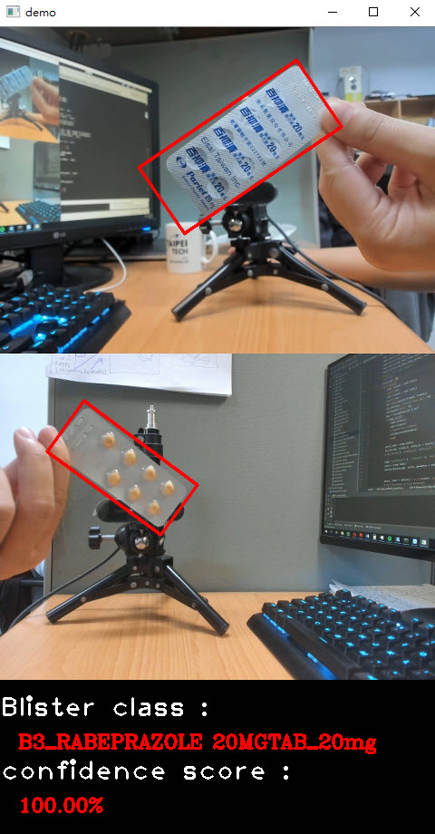

# Fast_ROR
### Introduction
The end-to-end framework for blister identification task
### Install
+ Python3.6
+ tensorflow 1.12.0
+ openCV
```
pip install -r requirements.txt
git clone -b dev https://github.com/FlyCho/FastROR.git
```
### Dataset fromat
```
├── datasets
│   ├── train
│       ├── Annotations
│       ├── JPEGImages
│   ├── test
│       ├── Annotations
│       ├── JPEGImages
```
`gt_img_X.txt`-file for each `img_X.jpg`-image-file

`gt_img_X.txt` have object number and object four corner coordinates on `img_X.jpg`, for each object in new line:

`<x_P1>, <y_P1>, <x_P2>, <y_P2>, <x_P3>, <y_P3>, <x_P4>, <y_P4>, <object-class>`

For example for `img_1.jpg` you will be created `gt_img_1.txt` containing:
```
180,262,220,137,381,188,345,317,0
197,888,106,601,478,533,526,788,0
```
### Generate the geometric and score map
```
python score_geo_map_prepare.py --dataset_dir=/path/to/your/training/set
```
after generated the geometric and score map
the dataset root will be ...
```
├── datasets
│   ├── train
│       ├── Annotations
│       ├── JPEGImages
|       ├── geo_map
|       ├── score_map
│   ├── test
│       ├── Annotations
│       ├── JPEGImages
```
### Two steps training strategy
We firstly train the localization network and then train the whole network, including the localization and recognition network.
### First step : training the localization network
```
python localization_train.py --gpu_list='0' --learning_rate=0.0001 --train_stage=2 --training_data_dir=/path/to/your/training images/ --training_gt_data_dir=/path/to/your/training annotations/
```
### Second step : training the whole network
```
python loc_recog_train.py --gpu_list='0' --learning_rate=0.0001 --train_stage=2 --training_data_dir=/path/to/your/training images/ --training_gt_data_dir=/path/to/your/training annotations/
```
### val
```
python loc_recog_val.py --gpu_list='0' --test_data_path='/path/to/your/testing images/' --test_gt_path='/path/to/your/testing annotations/' --checkpoint_path='checkpoints/'
```
### Demo
```
python loc_recog_demo.py
```
### Examples


### Reference
+ [FOTS_TF](https://github.com/Pay20Y/FOTS_TF/tree/dev)
Thanks for the authors!
